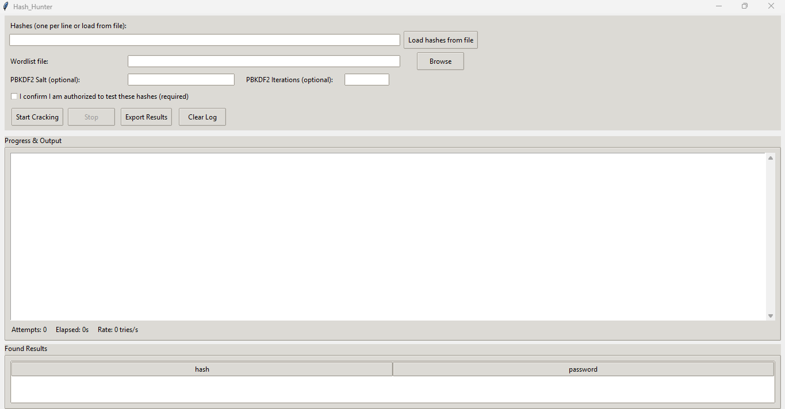
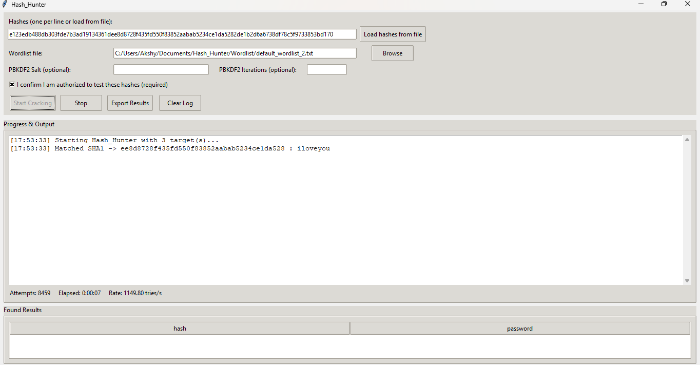
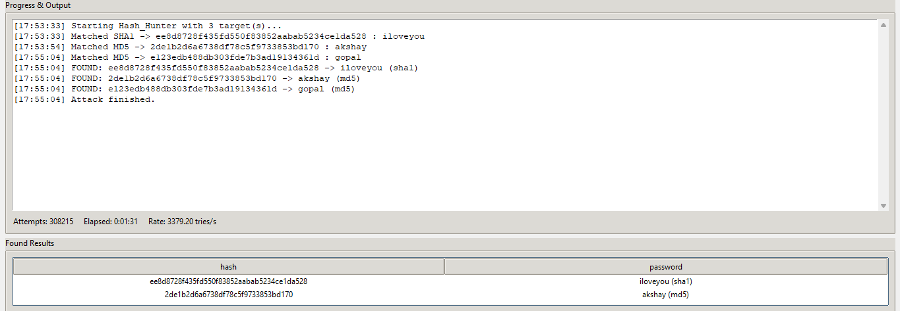

# 🕵️‍♂️ Cipher Breaker — Multi-Hash Password Cracking Tool

## 📌 Project Overview

**Cipher Breaker** is a Python-based cybersecurity tool designed to crack and verify hashed passwords using multiple hashing algorithms. It provides a real-time, GUI-based environment to test password strength by comparing hashes against a wordlist.

The application supports modern hashing techniques and includes live progress tracking, logging, and export functionality — making it ideal for learning, ethical hacking, and security testing.

---

## 🎯 Features

### 🔍 Multi-Hash Detection

Automatically detects and verifies hashes using:

* MD5
* SHA-1
* SHA-256
* PBKDF2-HMAC-SHA256
* bcrypt *(optional)*
* Argon2 *(optional)*

---

### ⚡ Real-Time Cracking Engine

* Fast wordlist-based password cracking
* Live attempt counter
* Real-time speed (tries/sec) display
* Stops automatically when all hashes are cracked

---

### 🧠 Smart Hash Handling

* Supports PBKDF2 formatted hashes (`iterations$salt$hash`)
* Manual salt & iteration input option
* Automatically detects hash types
* Avoids duplicate processing

---

### 💻 GUI Interface

Built with **Tkinter**, featuring:

* Hash input field or file upload
* Wordlist file selection
* Start/Stop cracking controls
* Live progress logs
* Results display table

---

### 🔔 Real-Time Logging & Alerts

* Displays matched hashes instantly
* Shows progress updates
* Logs all activities with timestamps

---

### 📁 Export Results

* Save cracked results to `.txt` file
* Structured format (hash → password)

---

## 🛠️ Tech Stack

* **Language:** Python
* **GUI:** Tkinter
* **Libraries:** hashlib, threading, tkinter, time, os
* **Optional Libraries:** bcrypt, argon2-cffi
* **Concepts:** Cryptography, Hashing, Multithreading, GUI Development

---

## 📂 Project Structure

```id="projstruct"
📦 Cipher Breaker.py

┣ 📜 Cipher Breaker.py     # Main GUI application
┣ 📜 encrypted.txt         # Sample hash input
┣ 📜 README.md             # Project documentation
┣ 📜 output.txt            # Exported results (generated)
┣ 📁 Images/
    ┗ 📜 Dashboard.png
    ┗ 📜 Live Progress.png
    ┗ 📜 Results.png
```

---

## 🚀 How to Run

### 1️⃣ Install Dependencies

```bash id="install"
pip install bcrypt argon2-cffi
```

*(Optional but recommended for full functionality)*

---

### 2️⃣ Run the Application

```bash id="run"
python Cipher Breaker.py
```

---

### 3️⃣ Start Cracking

* Enter hashes manually OR load from file
* Select a wordlist file
* (Optional) Enter PBKDF2 salt & iterations
* Confirm authorization checkbox
* Click **Start Cracking**

---

## 📸 Screenshots

🖥️ Main Dashboard



🖥️ Live Progress



🖥️ Results Table


---

## 📈 Skills Demonstrated

* Cryptographic hash analysis
* Password cracking techniques
* Multithreading in Python
* GUI development with Tkinter
* File handling & logging
* Secure coding practices

---

## ⚠️ Limitations

* Works only with wordlist-based attacks
* No brute-force or hybrid attack support
* Performance depends on wordlist size
* Not a full penetration testing suite
* Requires optional libraries for advanced hashes

---

## 🔮 Future Improvements

* Add brute-force attack mode
* GPU acceleration support
* Advanced hash auto-detection
* Wordlist generator integration
* Save/Resume cracking sessions
* Dark mode UI

---

## ⚠️ Disclaimer

This tool is intended **only for educational and authorized security testing purposes**.
Do not use it on systems or data without proper permission.

---

## 📬 Contact

**Name:** Akshay Kumar
**GitHub:** https://github.com/akshy24kumar-sketch

---

⭐ *If you found this project useful, consider giving it a star!*
